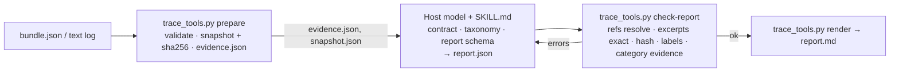

# Agent Failure Analysis

Give the skill a recorded agent run, the task, and whatever success criteria
exist. Get back an inspectable account of what happened, the failures the
evidence supports, the explanations that remain hypotheses, what is missing,
and a proposed regression test. Missing evidence stays missing. Successful
runs are reported as successful. Inconclusive runs are reported as unknown.

It is one installable skill folder (`SKILL.md`, four reference documents, one
Python file) for Claude Code and Codex-style hosts. The host model does the
interpretation. The Python helper does only deterministic checks: it never
calls a model, never touches the network, and never opens anything it finds
inside a trace.

Status: **V0, proposed for Leo's review.** Not published, not installed
globally. See `docs/decisions.md` for the decisions awaiting review.

## Supported inputs

| Input | How |
|---|---|
| Canonical bundle (`afa-bundle/1`, one JSON object) | Analysed directly. Format: `skills/agent-failure-analysis/references/bundle-schema.md`. |
| Plain text log | `trace_tools.py wrap-text` turns each line into one event, losslessly, and marks task, criteria, tool policy, final output, and evaluator as unknown or unavailable. |
| Any vendor trace format | Unsupported. The validator says so. Convert to a bundle first; the schema is small. |

Limits: 5,000,000 bytes and 5,000 events by default. Over-limit input is
rejected outright; nothing is analysed as a silent subset.

## What a report looks like

`examples/calculation-mistake/report.md` is a real report written by a fresh
Claude Code session following the skill on a synthetic trace where the
agent's own calculator returned `3.0` and the agent wrote `2.80`. It carries
one finding (`reasoning_calculation`, established), pins the divergence to
event `e6` with exact excerpts, keeps the *why* as two hypotheses with
confirm/refute conditions, and proposes a regression test as a specification.

`examples/incomplete-trace/report.md` is the other half of the promise: a
trace that stops after a tool call. Outcome `unknown`, no findings, three
hypotheses, and the list of what would discriminate them.

`examples/provider-failure/` (failure that is the provider's, not the
agent's) and `examples/defective-grader/` (the grader is wrong, the agent is
not) round out the set. Every example is synthetic and says so in its
provenance.

## Architecture



Python decides whether the input is well-formed and whether every reference
points at real text. The model decides what it means. `check-report` prints
on every run: *reference validity confirms that cited locations and excerpts
exist in the snapshot; it does not confirm that any interpretation follows
from them.* The full diagram and the table of what each side may and may
not do are in `docs/architecture.md`.

## Installation

Nothing here installs itself. Build or take the ZIP, then copy one folder.

```bash
python3 scripts/build_release.py
# → dist/agent-failure-analysis-0.1.1.zip and its .sha256
```

Claude Code (tested with 2.1.280): personal or project scope.

```bash
unzip dist/agent-failure-analysis-0.1.1.zip -d ~/.claude/skills/
```

```bash
unzip dist/agent-failure-analysis-0.1.1.zip -d .claude/skills/
```

Codex (format-compatible, untested): `.agents/skills/` or `~/.agents/skills/`.

Remove by deleting the folder. `INSTALL.md` inside the ZIP has the exact
commands for both hosts and the removal steps. Requirements: Python 3.11+,
no packages, no network.

## Usage

Ask the host, with the skill installed:

> Analyse the agent run in `runs/2026-09-20-migrate.json`. The task was to migrate the schema to v3; success is `alembic current` showing v3.

The skill runs `prepare`, reads the evidence packet and snapshot, writes
`report.json` under the evidence contract, loops on `check-report` until it
passes, and renders `report.md`. You get both paths and a short summary.

The helper on its own:

```bash
T=skills/agent-failure-analysis/scripts/trace_tools.py
python3 $T validate bundle.json
python3 $T wrap-text run.log --run-id r1 --task "..." -o bundle.json
python3 $T prepare bundle.json --out work/
python3 $T check-report work/report.json --snapshot work/snapshot.json --evidence work/evidence.json
python3 $T render work/report.json -o work/report.md
```

## Evaluation status

Recorded in `evaluation/RESULTS.md`. In short:

- Deterministic tests: 62 pytest cases, all passing on this machine.
- Skill behaviour, V0 build: 19 fresh Claude Code subagent sessions (`claude-fable-5-1`) across ten synthetic fixtures, running the skill from the source repository. All 19 skill-condition reports passed the checker and matched the retrospective answer keys on outcome, categories, and divergence. The keys were written afterwards by the same session that built the skill; they are development labels, not ground truth.
- Exploratory pilot, 12 runs on three fixtures: a plain prompt given only the schema produced one unsupported diagnosis, three truthful non-failures filed in the findings field, two invalid references, and one schema error across six runs; the skill condition produced none of those on the same six. This is not a reliability estimate and does not establish that the skill beats plain prompting.
- Release package: the 0.1.1 ZIP was installed in isolated throwaway projects and exercised end to end by fresh Claude Code sessions on three new frozen cases. See `evaluation/e2e/RESULTS.md` for what happened.
- Every semantic label is the implementing session's and is marked **unreviewed** until Leo reads the reports.

## Limitations

- **One model, synthetic data.** Every analysis session was the same model on hand-written traces. No real trace has been analysed yet.
- **Interpretation is the model's.** The checker guarantees citations exist and labels are allowed. It cannot tell a well-supported interpretation from a plausible-sounding one. Read the observation and its excerpts before trusting the interpretation.
- **The taxonomy is coarse.** Seven categories, each with a minimum required reference kind. That floor is mechanical and low; it stops some fabrications, not all.
- **Hosted data handling.** The package makes no outbound requests, but the host model still processes your trace under the host's terms. Do not analyse a sensitive log in a host you would not paste it into.
- **No adapters.** Vendor formats must be converted to the bundle by you.
- **Proposed tests are proposals.** Nothing in a report has been executed.
- **Codex untested.** Layout follows the documentation; no Codex session has run it.

## Repository layout

```
skills/agent-failure-analysis/   the skill (what the ZIP contains)
tests/                           pytest for the helper
evaluation/                      fixtures, answer keys (not packaged), rubric, recorded results, raw session outputs
examples/                        four synthetic bundles with the reports the skill produced
docs/                            architecture and decisions
scripts/build_release.py         builds the ZIP
```

## License

MIT. See `LICENSE`.
