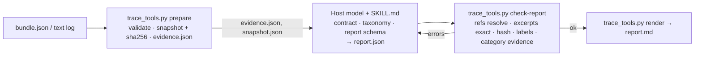

# Agent Failure Analysis

Agent Failure Analysis is one installable skill folder for Claude Code and Codex-style hosts: a `SKILL.md` workflow contract, four reference documents and one dependency-free Python helper that validates the trace and checks every citation in the report. Give it a recorded agent run, the task and whatever success criteria exist. Get back an account of what happened that is tied, excerpt by excerpt, to the trace, and that separates what the evidence establishes from what is still a guess.

**Result:** On ten synthetic fixtures, all 13 sessions that followed the skill produced reports that passed the deterministic checker and matched the retrospective answer keys, as first written, on outcome, categories and point of divergence (two keys were later revised; under them one report scores a category violation, see Evaluation). In a 12-run pilot on three of those fixtures, the six sessions given only the report schema produced one unsupported "established" diagnosis, three non-failures filed as findings, two references with empty excerpts and one schema error; none remained in the six final skill reports, though two skill sessions hit the empty-excerpt error on a first attempt and fixed it before a second `check-report` run, a repair loop the plain condition did not have. The exact release package passed three end-to-end cases, frozen by hash beforehand, in fresh sessions. 62 offline tests pass.

**Why it matters:** When an agent fails, the first question is what the evidence shows, not what a model thinks probably happened. Here deterministic code verifies that every cited location and excerpt really exists in the trace; the model interprets; and the checker states in print that it does not verify the interpretation. Missing evidence stays missing, successful runs are reported as successful, and inconclusive runs are reported as unknown.

**Status:** V0.1.1 release candidate. The repository is public; no release package has been published, Codex hosts are untested, and the semantic labels in the evaluation were written by the implementing session and are marked unreviewed until a human reads the reports. Approved and deferred decisions are in `docs/decisions.md`.

## In and out

**Input:** a recorded agent run as a small JSON bundle (`afa-bundle/1`), or a plain text log that `wrap-text` turns into one event per line, plus the task and any success criteria. Vendor trace formats are not parsed; convert them to the bundle first. Inputs over 5,000,000 bytes or 5,000 events are rejected outright, never analysed as a silent subset.

**Output:** `report.json` (rendered to `report.md`) containing:

- the outcome (success, failure or unknown) and its basis (evaluator observation, tool evidence, criteria match, agent claim, or none)
- findings, each with a taxonomy category, an observation, an interpretation, an evidence status (established, partial, contested) and references
- the earliest evidenced divergence from a path that would have satisfied the task
- causal hypotheses, each with what would confirm and what would refute it
- the missing information, and which hypothesis each item would discriminate
- a proposed regression test, as a specification that has not been executed

## One example

`examples/calculation-mistake/report.md` was written by a fresh Claude Code session following the skill (version 0.1.0) on a synthetic trace. The agent's own calculator returned `3.0` for the tax and the agent then wrote `2.80`. Trimmed from the report:

```
## Outcome
**FAILURE** (basis: `evaluator_observation`)

### F1: `reasoning_calculation` (evidence: established)
- **Observation:** In e4 the agent submitted the expression '37.50 * 0.08' to the
  calculator and in e5 the tool returned ok: true with output '3.0'. In e6 the
  agent's message states 'Tax at 8% is 2.80.' ...
- **References:** `ev:e6 /content/text` "Tax at 8% is 2.80."; `ev:e5 /content/output` "3.0";
  `ev:e4 /content/args/expression` "37.50 * 0.08"; `/final_output/text` "Total: 40.30"

## Earliest evidenced divergence
**Identified** at `e6`: ... the agent states the tax as 2.80 instead of the 3.0 returned in e5

## Causal hypotheses (not established root causes)
H1: The tool result 3.0 from e5 was present in the agent's context but the agent did not use it ...
H2: The tool result from e5 was recorded in the trace but was not delivered to the model ...

## Proposed regression test (specification, not executed)
- assert every numeric value in the final message that corresponds to a calculator call
  equals that call's output
```

The *what* is pinned to event `e6` with exact excerpts. The *why* stays as two hypotheses with confirm and refute conditions, because the trace does not show it. The other three examples cover a trace that stops after a tool call (outcome unknown, no findings, three hypotheses), a failure that belongs to the provider, and a grader that is wrong while the agent is not. Every example is synthetic and says so in its provenance.

## Where the code stops and the model begins



Python decides whether the input is well-formed and whether every reference points at real text in the snapshot. The model decides what the text means. `check-report` prints this on every run and the rendered report carries it:

> Reference validity confirms that cited locations and excerpts exist in the snapshot. It does not confirm that any interpretation follows from them.

Each of the seven failure categories has a minimum kind of reference it must cite (for example, `tool_execution` needs a tool result or error event; `environment_provider` needs a failed tool result or error). That floor is mechanical and low. It stops some fabrications, not all. The table of what each side may and may not do is in `docs/architecture.md`.

The whole thing is one installable skill folder (`SKILL.md`, four reference documents, one Python file) for Claude Code and Codex-style hosts. The Python helper never calls a model, never touches the network, and never opens anything it finds inside a trace.

## Evaluation

Recorded in `evaluation/RESULTS.md`; the numbers below are its counts.

- **Deterministic tests:** 62 pytest cases, all passing.
- **Skill behaviour, V0 build:** 19 fresh Claude Code subagent sessions across ten synthetic fixtures, running the skill from the source repository. 13 of the 19 followed the skill; all 13 reports passed the checker and matched the answer keys on outcome, categories and divergence. The keys were written afterwards by the same session that built the skill; they are development labels, not ground truth. Two keys (fixtures 02 and 10) were later revised; under the revised keys one skill report (fixture 02) would score a category violation.
- **Exploratory pilot:** the other 6 of the 19 sessions were given only the report schema, on the same three fixtures as 6 of the skill sessions. Counts above. This does not establish that the skill beats plain prompting; it is a check that the contract and checker change behaviour on these cases.
- **Release package:** the exact final 0.1.1 ZIP (sha256 `0b93e7c0…`) was installed in three throwaway projects and exercised end to end by fresh Claude Code sessions (`claude-opus-5-5`, Claude Code 2.1.280) on three cases whose expectations were frozen by hash beforehand. All three auto-invoked the skill, ran the packaged helper, passed the checker on the first executed run and stayed within the expectations. See `evaluation/e2e-final/RESULTS.md`.
- **Second pass:** a concurrent validation by a different session independently reproduced the builds and check records, ran the earlier 0.1.0 ZIP on three further cases, and recorded its findings and disagreements in `evaluation/REVIEW-second-pass.md`.

## Limitations

- **One model family, synthetic data.** Every analysis session was a Claude model on hand-written traces. No real trace has been analysed yet, and none of this measures real-world reliability.
- **Interpretation is the model's.** The checker guarantees citations exist and labels are allowed. It cannot tell a well-supported interpretation from a plausible-sounding one. Read the observation and its excerpts before trusting the interpretation.
- **The taxonomy is coarse.** Seven categories, each with a minimum required reference kind.
- **Hosted data handling.** The package makes no outbound requests, but the host model still processes your trace under the host's terms. Do not analyse a sensitive log in a host you would not paste it into.
- **No adapters.** Vendor formats must be converted to the bundle by you.
- **Proposed tests are proposals.** Nothing in a report has been executed.
- **Codex untested.** Layout follows the documentation; no Codex session has run it.

## Install and use

Nothing installs itself, and the ZIP is not committed. Build it, then copy one folder.

```bash
python3 scripts/build_release.py
# → dist/agent-failure-analysis-0.1.1.zip and its .sha256
```

Claude Code (tested with 2.1.280), personal or project scope:

```bash
unzip dist/agent-failure-analysis-0.1.1.zip -d ~/.claude/skills/
```

```bash
unzip dist/agent-failure-analysis-0.1.1.zip -d .claude/skills/
```

Codex (format-compatible, untested): `.agents/skills/` or `~/.agents/skills/`. Remove by deleting the folder. `INSTALL.md` inside the ZIP has the exact commands for both hosts. Requirements: Python 3.11+, no packages, no network.

Then ask the host, with the skill installed:

> Analyse the agent run in `runs/2026-09-20-migrate.json`. The task was to migrate the schema to v3; success is `alembic current` showing v3.

The skill runs `prepare`, reads the evidence packet and snapshot, writes `report.json` under the evidence contract, loops on `check-report` until it passes, and renders `report.md`. The helper on its own:

```bash
T=skills/agent-failure-analysis/scripts/trace_tools.py
python3 $T validate bundle.json
python3 $T wrap-text run.log --run-id r1 --task "..." -o bundle.json
python3 $T prepare bundle.json --out work/
python3 $T check-report work/report.json --snapshot work/snapshot.json --evidence work/evidence.json
python3 $T render work/report.json -o work/report.md
```

Tests: `python3 -m pytest -q` (no model calls, no network).

## Repository layout

```
skills/agent-failure-analysis/   the skill (what the ZIP contains)
tests/                           pytest for the helper
evaluation/                      fixtures, answer keys (not packaged), rubric, recorded results, raw session outputs
examples/                        four synthetic bundles with the reports the skill produced
docs/                            architecture and decisions
scripts/build_release.py         builds the ZIP
```

## License

MIT. See `LICENSE`.
