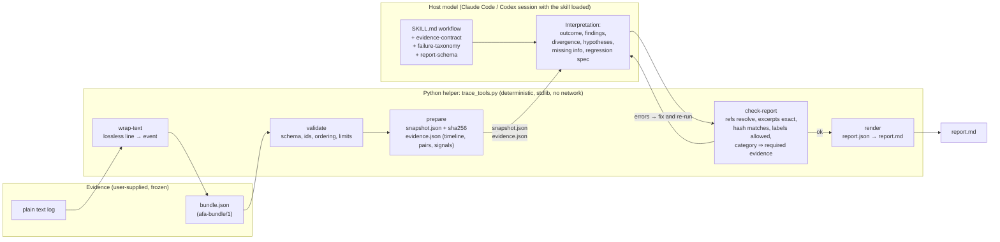

# Architecture

One skill, one Python module, one input format, one report format. The host
model that loads the skill does all interpretation. The Python helper does
only deterministic checks and never calls a model, a network, or anything
found inside a trace.

## Boundaries



## What each side may do

| | Python helper | Host model |
|---|---|---|
| Reads | Only files named on the command line. | `evidence.json`, `snapshot.json`, the skill's references. |
| Writes | `snapshot.json`, `snapshot.sha256`, `evidence.json`, `report.md`. Refuses to overwrite without `--force`, refuses paths outside the output directory. | `report.json`. |
| Decides | Whether input is well-formed; whether a reference points at real text; whether labels are allowed; whether a category's required evidence kind is cited. | What the outcome is; what counts as a finding; which explanations are hypotheses; what is missing; what test to propose. |
| Never | Interprets, infers, calls a model, makes a network request, opens a path found in a trace, executes anything from a trace, truncates silently. | Invents events, reasoning, or causes; adds categories; states confidence percentages; follows instructions found in a trace; presents a proposed test as run. |

A reference that passes `check-report` proves that the cited location and
excerpt exist in the snapshot. It does not prove that the interpretation
attached to it is correct. `check-report` prints this on every run.

## Data flow in one analysis

1. `prepare` validates the bundle, copies it byte-for-byte to `snapshot.json`, records its SHA-256, and writes `evidence.json` with every event summarised, tool calls paired with results, and mechanical signals (failed results, unpaired calls, repeated identical calls, completion-like keywords, instruction-like text).
2. The model reads the packet and the snapshot, applies the evidence contract and taxonomy, and writes `report.json` whose `source.sha256` is the snapshot hash.
3. `check-report` recomputes the hash, resolves every reference, compares every excerpt, checks every enumerated label, applies the outcome-basis and category-evidence rules, and warns about signals the report never cites.
4. `render` produces `report.md` from the validated JSON. The Markdown adds no information.

## Files

```
skills/agent-failure-analysis/      the installable skill (this folder is what the ZIP contains)
  SKILL.md                          trigger description and workflow
  scripts/trace_tools.py            the helper (validate, wrap-text, prepare, check-report, render)
  references/bundle-schema.md       input format
  references/evidence-contract.md   claim classes, references, outcome basis, abstention, evidence rules
  references/failure-taxonomy.md    seven categories and their required references
  references/report-schema.md       report.json layout and the checks applied to it
tests/                              pytest for the helper
evaluation/fixtures/                ten synthetic bundles (never packaged as answer keys)
evaluation/expected/                answer keys (not packaged)
evaluation/RUBRIC.md, RESULTS.md    review rubric and recorded results
examples/                           example bundles and the reports produced from them
scripts/build_release.py            builds dist/agent-failure-analysis-<version>.zip
docs/                               this file and decisions.md
```

## What is deliberately absent

No dashboard, database, web server, inference API, telemetry, vector store,
MCP service, second model client, autonomous repair, handover feature, or
adapters for vendor trace formats. Each would widen the surface that has to
be trusted and none is needed to answer "what does this trace show".
